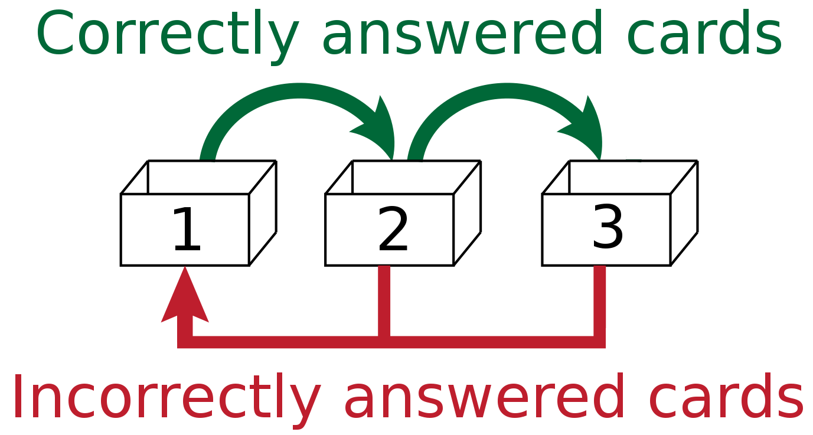

# Spaced - Leitner System based learning app.

Spaced is a learning app that uses the Leitner System for spaced repetition.

### The Leitner System

In this system, flashcards are sorted into groups (boxes) according to how well the learner knows each one in Leitner's learning box. The learners try to recall the solution written on a flashcard. If they succeed, they send the card to the next box. If they fail, they send it back to the first box. Each succeeding box has a longer period before the learner is required to revisit the cards. 

#### This application uses the following 3 boxes:
1. Box 1: Flashcards in this box are reviewed everyday.
1. Box 2: Flashcards in this box are reviewed every other day.
1. Box 3: Flashcards in this box are reviewed only once a week.

### Using the Leitner System:
1. Start by placing all flashcards in **Box 1**.
1. On day 1, select flashcards in Box 1 and if you answer a flashcard correctly, place that card into **Box 2**, else place it into **Box 1**.
1. On day 2, review cards in both **Box 1 and Box 2**.
    * Place correctly answered cards into next box. Incorrectly answered cards go back to **Box 1**.
1. On day 3, repeat the same steps as of Day 1.
1. On day 4, repeat the same steps as of Day 2.
1. On day 5, review flashcards in **all the boxes**.
    * If you answer a card correctly, place it in Box 3 else, place it in Box 1.
1. Repeat from step 2 if there are cards left in **Box 1**.
1. When all cards of a deck are in Box 3, then you have mastered the deck.

> Note: When you place a card to a box, mark it as reviewed to prevent revisiting of cards in the same session.